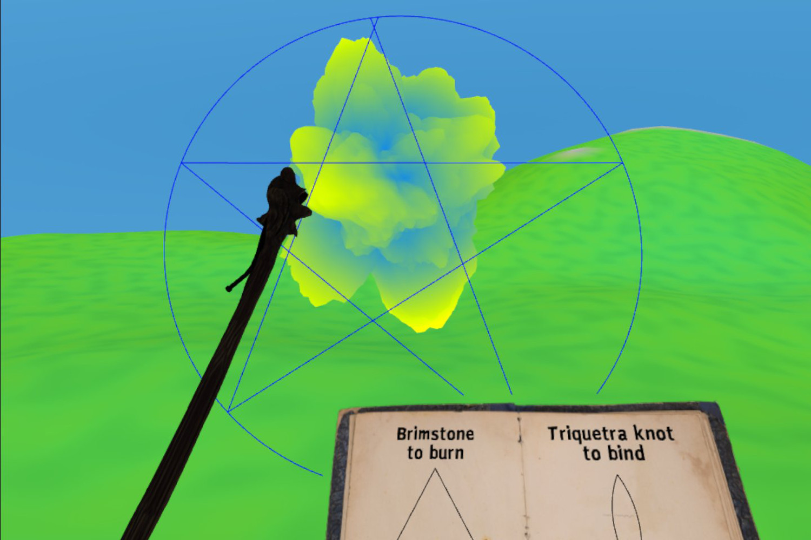

# Barrier Mage
In fantasy, a wizard draws mystic symbols to work a magic spell.
In this VR demo, you can too!

Live on [github.io](https://dougreeder.github.io/barrier-mage/)

Uses WebXR and [A-Frame](https://aframe.io) and requires two 6-DOF controllers.

The six symbols currently supported are:

At present, there is one sad caveat:
* My landscape component doesn't respond to point light sources, so the only effect of writing the day rune is to light up your hands and staff.

Grip button: grab staff 
Staff hand trigger: Press and hold to draw straight segment 
Staff hand A or X Button: Press and hold to draw arc or circle 
Off hand trigger: Page forward 
Off hand A or X Button: Page backward 
Left Joystick: walk

If you're moved to create a fantasy landscape that can use point light sources, I'd much appreciate such a contribution!
Likewise, various creatures to be fended off with the barriers. 
