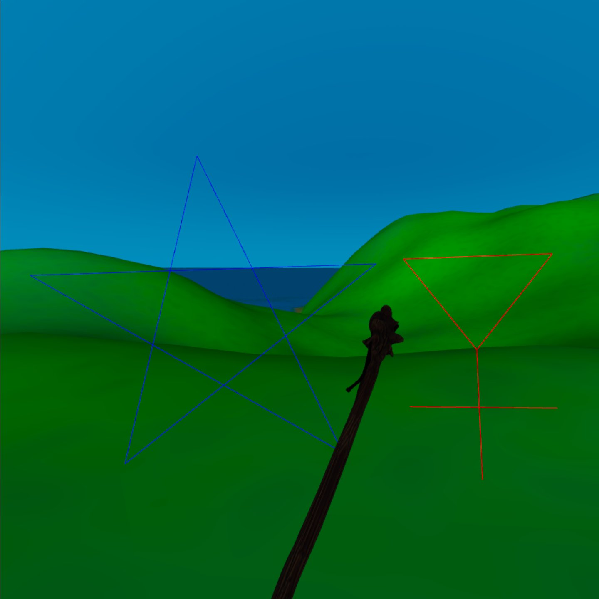

# Barrier Mage
In fantasy, a wizard draws mystic symbols to work a magic spell.
In this VR experience, you can too!

Live on [github.io](https://dougreeder.github.io/barrier-mage/)

Uses WebXR and [A-Frame](https://aframe.io) and requires a 6-DOF controller.

The six symbols currently supported are:

At present, there are a few sad caveats:
* The barriers don't actually do anything yet!
* There are no actual creatures to fend off!
* My landscape component doesn't respond to point light sources, so the only effect of writing the day rune is to light up your hands and staff.

Press and release a grip button to move your staff to that hand.
Press and hold the trigger on your staff hand to draw a straight segment.
Press and hold the A or X button on your staff hand to draw an arc or circle.
~~Press and hold the trigger on your empty hand to fire sparks to annoy creatures.~~

If you're moved to create a fantasy landscape that can use point light sources, I'd much appreciate such a contribution!
Likewise, creatures to be fended off with the barriers. 
