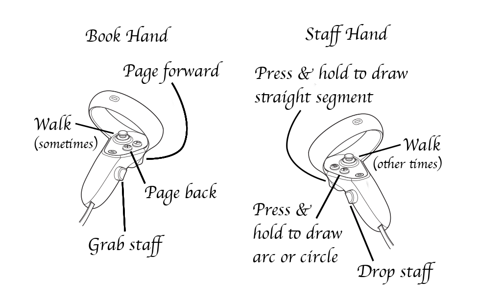

# Barrier Mage
Draw mystic symbols which burn, protect, bind, detect, illuminate or link. Use these spells to drive off creatures both mundane and magical!

Live on [github.io](https://dougreeder.github.io/barrier-mage/)

Uses WebXR and [A-Frame](https://aframe.io) and requires two 6-DOF controllers.

The six symbols currently supported are:

At present, there is one sad caveat:
* My landscape component doesn't respond to point light sources, so the only effect of writing the day rune is to light up your hands and staff.

Grip button: grab staff 
Staff hand trigger: Press and hold to draw straight segment 
Staff hand A or X Button: Press and hold to draw arc or circle 
Off hand trigger: Page forward 
Off hand A or X Button: Page backward 
Joystick: walk

Brimstone to burn 
Triquetra knot to bind 
Borromean rings to link 
Pentacle to protect 
Quicksilver to detect 
Dagaz (day rune) to illuminate

If you're moved to create a fantasy landscape that can use point light sources, I'd much appreciate such a contribution!
Likewise, various creatures to be fended off with the barriers. 
